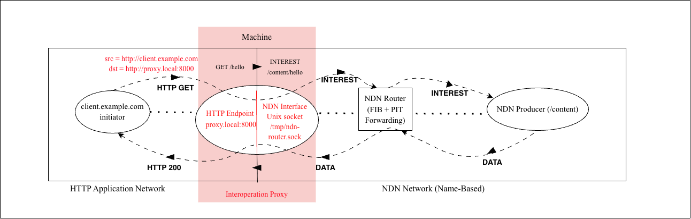

# HTTP -> NDN Interoperation Proxy

This project implements an **Interoperation Proxy** between two fundamentally distinct overlay networks, serving as a gateway in a **compositional network architecture**.

1. **The Web Network (Location-Addressed)**: Clients communicating via standard HTTP over TCP/IP point-to-point connections.
2. **The Named Data Networking (NDN) Network (Content-Addressed)**: Nodes communicating strictly via Name-Based Routing, utilizing a central Forwarding Information Base (FIB) without any concept of IP addresses or TCP ports.

## Compositional Networking & Architectural Goals

In modern networking, a **compositional network architecture** seamlessly connects heterogeneous domains—networks with entirely different mechanisms for addressing, routing, and delivery. 

The primary goal of this project is to construct a true interoperation proxy rather than a simple middlebox. A standard middlebox simply relays or alters packets within the same architectural namespace (e.g., mapping one TCP connection to another IP/Port on a backend). This proxy, however, enables a compound session that completely crosses architectural boundaries:

- **Semantic Translation**: It bridges the foundational gap between "Where is the server?" (HTTP/TCP) and "What is the content?" (NDN).
- **Physical Decoupling**: The NDN side relies entirely on local Unix Domain Sockets to simulate a distinct overlay network. The proxy has zero knowledge of the IP addresses, ports, routing paths, or locations of the NDN data server. It simply asks the network for a name.

This proves that compound sessions can be successfully established across natively incompatible networks by enforcing strict, distinct boundaries in both the addressing formats and the message delivery mechanisms.

---

## System Components

The system enforces strict topological decoupling through three distinct Python components:



### 1. The NDN Forwarding Router (`src/router.py`)
This script acts as the core routing fabric of the simulated NDN network. 
- It binds to a purely local Unix Socket (`/tmp/ndn-router.sock`), preventing ordinary Web IP semantics from leaking into the NDN topology.
- It maintains a **Forwarding Information Base (FIB)**, logging which active sockets own which data prefixes.
- It maintains a **Pending Interest Table (PIT)**, keeping track of which proxy connections are waiting for which data chunks so it can route responses directly back to the requester.
- **Strict Separation:** It is the only entity that knows how to route NDN traffic.

### 2. The NDN Server/Producer (`src/server.py`)
A simulated data producer residing on the NDN network.
- **No IP or Port**: It does not establish TCP listening ports.
- It acts as a passive client to the Router, connecting to the Unix Socket and announcing its available namespaces: `REGISTER /content`.
- It listens for `INTEREST` messages exclusively from the Router, computing and replying with pure `DATA` objects.

### 3. The Interoperation Proxy (`src/proxy.py`)
The translation gateway bridging the Web and NDN networks.
- It acts as an HTTP server responding on `localhost:8000`.
- It parses incoming `GET /hello HTTP/1.1` requests from standard Web clients.
- It translates the request into an abstract NDN Interest: `INTEREST /content/hello`.
- **No Routing Logic**: Instead of looking up an IP address for a destination server, it blindly dumps the Interest into the router's Unix Socket, shifting the routing burden completely onto the NDN Forwarder.

---

## How to Run

Because the NDN topology strictly relies on the router to handle message passing, you must start the components in order. Open your terminal to the project root:

**1. Start the NDN Forwarding Router**
```bash
python3 src/router.py
```

**2. Start the NDN Server/Producer**
```bash
python3 src/server.py
```

**3. Start the Interoperation Proxy**
```bash
python3 src/proxy.py
```

### Testing the Network

You can now use any standard HTTP client (like your web browser or `cURL`) to request data from the NDN network. The requests will traverse the compound session architecture seamlessly:

```bash
# Request valid data
curl http://localhost:8000/hello
# Output: Hello World

# Request valid test data
curl http://localhost:8000/test
# Output: Test Content

# Request an invalid name
curl http://localhost:8000/missing
# Output: NOT_FOUND
```

Alternatively, you can run the automated integration test suite which tests the entire 3-node lifecycle concurrently:
```bash
python3 src/test_system.py
```